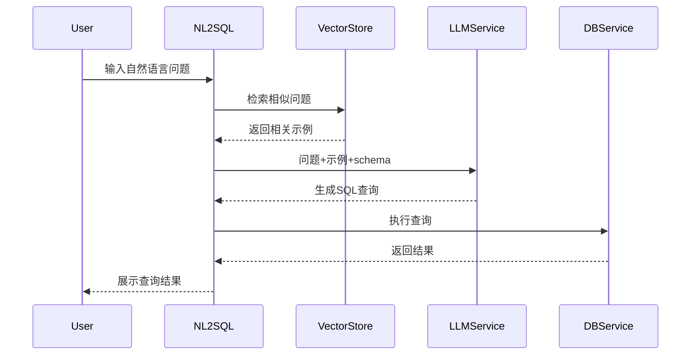

## 1. 核心实现原理
在自然语言转SQL（NL2SQL）任务中，系统需要将用户的自然语言问题准确转换为可执行的SQL查询语句。基于最新研究，其核心实现涉及以下关键要素：

### 1.1 训练数据构成
+ 自然语言问题与对应SQL查询对
+ 数据库结构信息
+ 历史查询示例
+ 查询结果验证数据

### 1.2 主流训练模式
| 模式类型 | 核心特点 | 技术特征 | 应用场景 | 优势 | 局限性 |
| --- | --- | --- | --- | --- | --- |
| **直接转换** | 模型直接理解转换 | • 仅使用数据库结构   • 无需训练数据 | 简单查询场景 | • 快速部署   • 维护简单 | • 性能有限   • 准确率低 |
| **示例学习** | "看例子学习"模式 | • 使用固定SQL示例   • 基于模板匹配 | 特定领域查询 | • 实现成本适中   • 针对性强 | • 扩展性差   • 场景受限 |
| **相似匹配** | 动态检索辅助生成 | • 向量数据库检索   • 实时更新示例 | 复杂查询场景 | • 性能优异   • 可持续优化 | • 依赖示例库   • 实现复杂 |
| **智能问答** | 类人对话交互 | • 完整问答对训练   • 上下文感知 | 交互式场景 | • 体验最佳   • 功能全面 | • 资源消耗大   • 成本较高 |

### 1.3 训练效果对比
| 训练模式 | 准确率 | 实现复杂度 | 维护成本 | 适用场景 |
| --- | --- | --- | --- | --- |
| 直接转换 | 35% | 低 | 低 | 简单查询 |
| 示例学习 | 50% | 中 | 中 | 特定领域 |
| 相似匹配 | 75% | 高 | 中 | 复杂查询 |
| 智能问答 | 85% | 高 | 高 | 交互式场景 |

### 1.3 训练效果对比
| 训练模式 | 准确率 | 实现复杂度 | 维护成本 | 适用场景 |
| --- | --- | --- | --- | --- |
| 直接转换 | 35% | 低 | 低 | 简单查询 |
| 示例学习 | 50% | 中 | 中 | 特定领域 |
| 相似匹配 | 75% | 高 | 中 | 复杂查询 |
| 智能问答 | 85% | 高 | 高 | 交互式场景 |

## 2. 系统架构设计

## 3. 技术方案综合分析
| 评估维度 | 检索增强生成路线 | 模型微调方案 | 当前系统架构 | 改进建议 |
| --- | --- | --- | --- | --- |
| **效率表现** | • 无需定期重训练   • 示例库可持续更新   • 系统稳定性好 | • 训练数据需求大   • 计算成本高昂   • 环境要求严格 | • 功能模块独立   • 接口定义清晰   • 维护性好 | • 引入查询缓存   • 优化检索算法   • 加强结果验证 |
| **质量保障** | • 基于相似性检索   • 上下文信息丰富   • 准确率有保障 | • 需要定期更新   • 版本管理复杂   • 调试成本高 | • 支持多种数据存储   • 兼容主流语言模型   • 架构松耦合 | • 支持实时处理   • 完善监控体系   • 强化安全机制 |
| **系统特性** | • 部署要求低   • 集成便捷   • 可快速调整 | • 易出现过拟合   • 场景适应性差   • 扩展性不足 | • 分布式支持   • 性能可横向扩展   • 功能易扩充 | - |

### 3.1 方案优劣势总结
1. **检索增强生成路线**
    - 优势：运维效率高，结果质量好，系统灵活性强
    - 特点：适合快速迭代和持续优化的场景
2. **模型微调方案**
    - 劣势：资源消耗大，维护难度高，应用受限
    - 特点：适合数据量稳定且场景单一的应用
3. **当前系统架构**
    - 优势：组件化程度高，系统弹性好，扩展性强
    - 改进：需要在性能优化和架构增强方面持续投入

## 5. 实施路径与发展展望
### 5.1 实施阶段分析
| 阶段 | 关键活动 | 实施要点 | 预期效果 |
| --- | --- | --- | --- |
| **准备阶段** | • 收集用户查询   • 构建示例库   • 标注数据关系 | • 确保数据质量   • 验证覆盖度   • 建立评估标准 | 形成高质量训练基础 |
| **实施阶段** | • 直接转换验证   • 示例学习提升   • 相似匹配扩展 | • 循序渐进   • 及时优化   • 持续迭代 | 系统功能逐步完善 |
| **优化阶段** | • 更新示例库   • 监控性能   • 收集反馈 | • 动态调整   • 持续改进   • 性能优化 | 系统稳定性提升 |

### 5.2 技术模式选型参考
| 应用场景 | 推荐模式 | 主要优势 | 实施重点 |
| --- | --- | --- | --- |
| 简单查询 | 直接转换 | 快速实现，成本低 | 优化模型理解能力 |
| 特定领域 | 示例学习 | 精准度高，针对性强 | 构建典型示例集 |
| 复杂查询 | 相似匹配 | 扩展性好，准确率高 | 优化向量检索 |
| 交互场景 | 智能问答 | 体验优，功能全 | 增强上下文处理 |

### 5.3 未来发展规划
| 发展方向 | 具体措施 | 预期成果 |
| --- | --- | --- |
| **技术升级** | • 优化示例库更新机制   • 改进相似度计算   • 增强结果解释 | 系统性能提升 |
| **功能扩展** | • 支持跨领域应用   • 完善异常处理   • 增加新场景适配 | 应用范围扩大 |
| **生态建设** | • 建立评估体系   • 开放接口规范   • 促进社区协作 | 生态系统完善 |

## 参考文献
1. "提升SQL生成准确率的上下文感知检索方法研究", 2023
2. "检索增强生成与模型微调在自然语言转SQL任务中的对比研究", 2023
3. "自然语言转SQL系统最佳实践指南", 2024
4. "自然语言转SQL系统的演进与发展趋势分析", 2024
